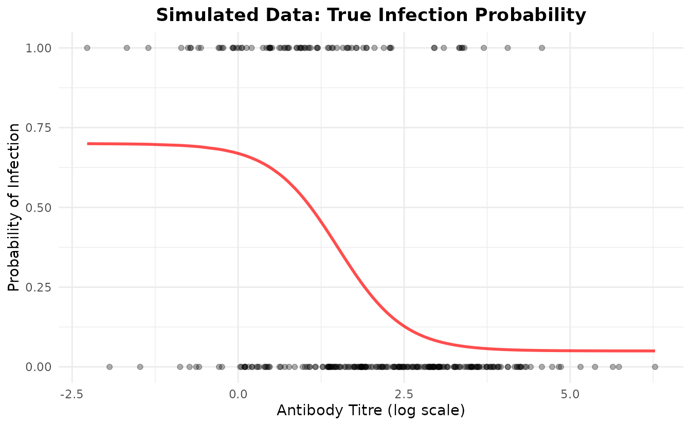
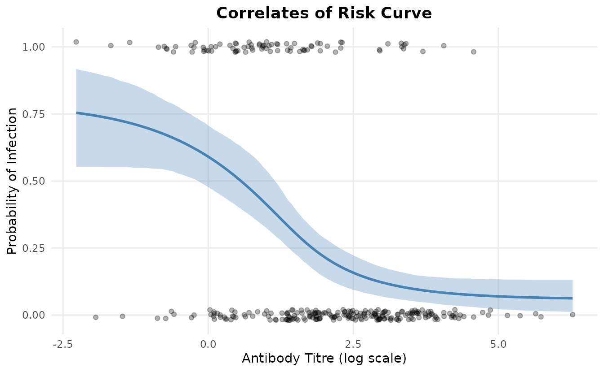
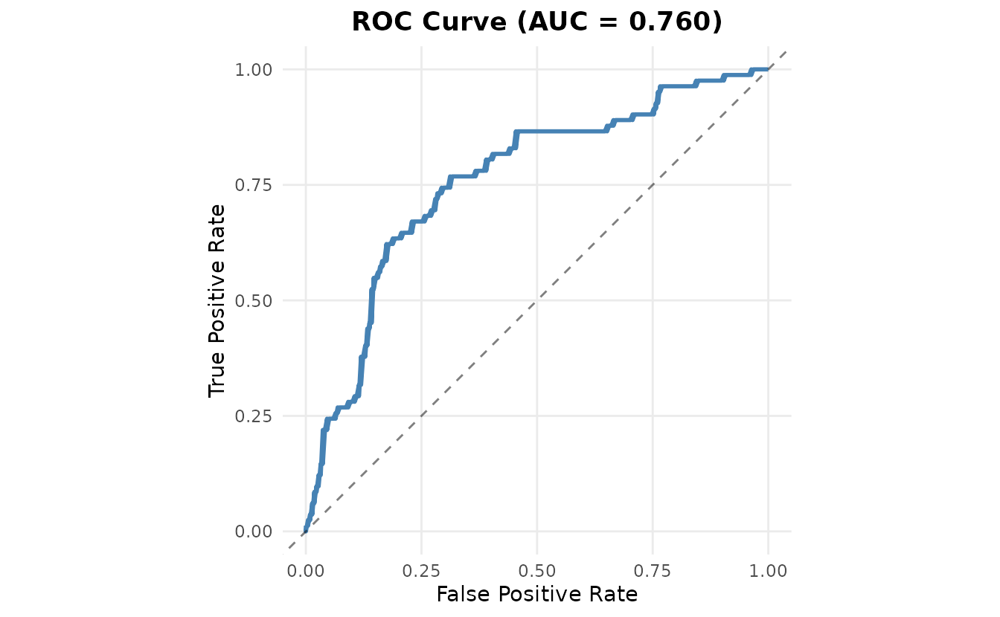
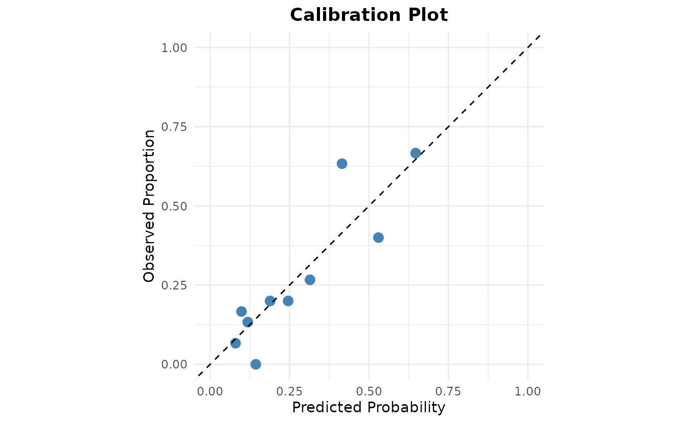

# Simulation and Recovery Analysis with seroCOP

## Introduction

This vignette demonstrates how to use the `seroCOP` package to analyze
correlates of protection using Bayesian methods. We’ll simulate data
from a known four-parameter logistic model, fit the model, and validate
that we can recover the true parameters.

### Load the package

``` r
library(seroCOP)
library(ggplot2)
```

## Simulate Data

We’ll simulate data where the probability of infection follows a
four-parameter logistic curve as a function of antibody titre. The
parameters we’ll use are:

- **floor** = 0.05 (5% minimum infection probability)
- **ceiling** = 0.90 (90% maximum infection probability)
- **ec50** = 1.5 (titre at 50% infection probability)
- **slope** = 2.0 (steepness of the curve)

``` r
# Set parameters for simulation
set.seed(2025)

true_params <- list(
  floor = 0.05,
  ceiling = 0.90,
  ec50 = 1.5,
  slope = 2.0
)

# Simulate data
sim_data <- simulate_serocop_data(
  n = 300,
  floor = true_params$floor,
  ceiling = true_params$ceiling,
  ec50 = true_params$ec50,
  slope = true_params$slope,
  titre_mean = 2.0,
  titre_sd = 1.5,
  seed = 2025
)

# Examine the simulated data
cat(sprintf("Sample size: %d\n", length(sim_data$titre)))
#> Sample size: 300
cat(sprintf("Infection rate: %.1f%%\n", mean(sim_data$infected) * 100))
#> Infection rate: 39.0%
cat(sprintf("Titre range: [%.2f, %.2f]\n", 
            min(sim_data$titre), max(sim_data$titre)))
#> Titre range: [-2.27, 6.28]
```

### Visualize the Simulated Data

``` r
# Create a plot showing the true relationship
plot_df <- data.frame(
  titre = sim_data$titre,
  infected = sim_data$infected,
  prob_true = sim_data$prob_true
)

ggplot(plot_df, aes(x = titre, y = prob_true)) +
  geom_line(color = "red", linewidth = 1, alpha = 0.7) +
  geom_point(aes(y = infected), alpha = 0.3) +
  labs(
    title = "Simulated Data: True Infection Probability",
    x = "Antibody Titre (log scale)",
    y = "Probability of Infection"
  ) +
  theme_minimal() +
  theme(plot.title = element_text(hjust = 0.5, face = "bold"))
```



## Fit the Model

Now we’ll create a `SeroCOP` object and fit the Bayesian model to our
simulated data.

### Setting Priors

The `seroCOP` package allows you to customize prior distributions. By
default:

- **ec50** is centered at the midpoint of the observed titre range
- **ec50_sd** is set to titre_range / 4
- **floor** ~ Beta(1, 9) - weak prior favoring low infection at high
  titres
- **ceiling** ~ Beta(9, 1) - weak prior favoring high infection at low
  titres
- **slope** ~ Normal(0, 2) - weakly informative, truncated at 0

``` r
# Initialize SeroCOP object
model <- SeroCOP$new(
  titre = sim_data$titre,
  infected = sim_data$infected
)
#> SeroCOP initialized with 300 observations
#>   Infection rate: 39.0%
#>   Titre range: [-2.27, 6.28]

# View default priors (automatically set based on data)
cat("Default priors:\n")
#> Default priors:
print(model$priors)
#> $floor_alpha
#> [1] 1
#> 
#> $floor_beta
#> [1] 9
#> 
#> $ceiling_alpha
#> [1] 9
#> 
#> $ceiling_beta
#> [1] 1
#> 
#> $ec50_mean
#> [1] 2.002654
#> 
#> $ec50_sd
#> [1] 2.138259
#> 
#> $slope_mean
#> [1] 0
#> 
#> $slope_sd
#> [1] 2
```

You can customize priors if you have prior knowledge:

``` r
# Example: Set custom priors (not run in this vignette)
model$definePrior(
  floor_alpha = 2, floor_beta = 18,      # Stronger prior: E[floor] ≈ 0.1
  ceiling_alpha = 18, ceiling_beta = 2,  # Stronger prior: E[ceiling] ≈ 0.9
  ec50_mean = 2.0, ec50_sd = 1.0,        # Informative prior on ec50
  slope_mean = 0, slope_sd = 1           # More conservative slope
)
```

### Fitting the Model

``` r
# Fit the model (using default data-driven priors)
# Note: Using fewer iterations for vignette speed; 
# use more (e.g., iter=2000) for real analysis
model$fit_model(
  chains = 4,
  iter = 1000,
  warmup = 500,
  cores = 1  # Adjust based on your system
)
#> Warning: Bulk Effective Samples Size (ESS) is too low, indicating posterior means and medians may be unreliable.
#> Running the chains for more iterations may help. See
#> https://mc-stan.org/misc/warnings.html#bulk-ess
#> Warning: Tail Effective Samples Size (ESS) is too low, indicating posterior variances and tail quantiles may be unreliable.
#> Running the chains for more iterations may help. See
#> https://mc-stan.org/misc/warnings.html#tail-ess
```

## Model Diagnostics

### Parameter Summary

Let’s examine the posterior distributions of the parameters and compare
them to the true values:

``` r
# Get parameter summary
param_est <- extract_parameters(model, prob = 0.95)
print(param_est)
#>   parameter       mean     median      lower     upper
#> 1     floor 0.09642708 0.09786847 0.02485813 0.1676064
#> 2   ceiling 0.88623967 0.88434593 0.77492731 0.9929769
#> 3      ec50 1.45779155 1.46501599 1.13277387 1.7373545
#> 4     slope 2.58401348 2.44805019 1.19778888 4.7727179

# Compare to true values
cat("\nTrue Parameters:\n")
#> 
#> True Parameters:
cat(sprintf("  floor:   %.3f\n", true_params$floor))
#>   floor:   0.050
cat(sprintf("  ceiling: %.3f\n", true_params$ceiling))
#>   ceiling: 0.900
cat(sprintf("  ec50:    %.3f\n", true_params$ec50))
#>   ec50:    1.500
cat(sprintf("  slope:   %.3f\n", true_params$slope))
#>   slope:   2.000
```

### Parameter Recovery

Let’s visualize how well we recovered the true parameters:

``` r
# Create comparison plot
recovery_df <- data.frame(
  parameter = param_est$parameter,
  estimated = param_est$mean,
  lower = param_est$lower,
  upper = param_est$upper,
  true = c(true_params$floor, true_params$ceiling, 
           true_params$ec50, true_params$slope)
)

ggplot(recovery_df, aes(x = parameter)) +
  geom_pointrange(aes(y = estimated, ymin = lower, ymax = upper),
                  color = "steelblue", size = 1) +
  geom_point(aes(y = true), color = "red", size = 3, shape = 4) +
  labs(
    title = "Parameter Recovery",
    subtitle = "Blue: Estimated (95% CI) | Red X: True Value",
    x = "Parameter",
    y = "Value"
  ) +
  theme_minimal() +
  theme(plot.title = element_text(hjust = 0.5, face = "bold"),
        plot.subtitle = element_text(hjust = 0.5))
```


## Performance Metrics

Now let’s evaluate the model’s predictive performance:

``` r
# Get performance metrics
metrics <- model$get_metrics()
#> Performance Metrics:
#>   ROC AUC: 0.839
#>   Brier Score: 0.150
#>   LOO ELPD: -145.51 (SE: 9.96)
```

The model shows good performance:

- **ROC AUC**: 0.839 (closer to 1 is better)
- **Brier Score**: 0.150 (closer to 0 is better)
- **LOO ELPD**: -145.51 (higher is better)

## Visualization

### Fitted Curve

``` r
model$plot_curve()
```



The plot shows:

- **Blue line**: Posterior mean prediction
- **Blue ribbon**: 95% credible interval
- **Points**: Observed infection outcomes (jittered for visibility)

### ROC Curve

``` r
model$plot_roc()
```



## Posterior Predictive Checks

Let’s examine the posterior predictive distribution:

``` r
# Get predictions
predictions <- model$predict()

# Calculate prediction intervals
pred_mean <- colMeans(predictions)
pred_lower <- apply(predictions, 2, quantile, probs = 0.025)
pred_upper <- apply(predictions, 2, quantile, probs = 0.975)

# Plot calibration
calib_df <- data.frame(
  observed = sim_data$infected,
  predicted = pred_mean,
  titre = sim_data$titre
)

# Binned calibration plot
breaks <- quantile(calib_df$titre, probs = seq(0, 1, 0.1))
calib_df$bin <- cut(calib_df$titre, breaks = breaks, include.lowest = TRUE)

calib_summary <- aggregate(
  cbind(observed, predicted) ~ bin,
  data = calib_df,
  FUN = mean
)

ggplot(calib_summary, aes(x = predicted, y = observed)) +
  geom_point(size = 3, color = "steelblue") +
  geom_abline(slope = 1, intercept = 0, linetype = "dashed") +
  labs(
    title = "Calibration Plot",
    x = "Predicted Probability",
    y = "Observed Proportion"
  ) +
  theme_minimal() +
  theme(plot.title = element_text(hjust = 0.5, face = "bold")) +
  coord_equal(xlim = c(0, 1), ylim = c(0, 1))
```



## Cross-Validation

The Leave-One-Out Cross-Validation (LOO-CV) provides an estimate of
out-of-sample predictive performance:

``` r
# Print LOO details
print(model$loo)
#> 
#> Computed from 2000 by 300 log-likelihood matrix.
#> 
#>          Estimate   SE
#> elpd_loo   -145.5 10.0
#> p_loo         3.9  0.4
#> looic       291.0 19.9
#> ------
#> MCSE of elpd_loo is 0.0.
#> MCSE and ESS estimates assume independent draws (r_eff=1).
#> 
#> All Pareto k estimates are good (k < 0.7).
#> See help('pareto-k-diagnostic') for details.
```

Key LOO metrics:

- **elpd_loo**: Expected log pointwise predictive density
- **p_loo**: Effective number of parameters
- **looic**: LOO information criterion (lower is better)

## Conclusion

This vignette demonstrated:

1.  ✅ Simulating data from a four-parameter logistic model
2.  ✅ Fitting the Bayesian model using the `SeroCOP` R6 class
3.  ✅ Recovering true parameter values with credible intervals
4.  ✅ Calculating performance metrics (ROC AUC, Brier score, LOO-CV)
5.  ✅ Visualizing results with diagnostic plots

The `seroCOP` package provides a complete workflow for correlates of
protection analysis with proper uncertainty quantification through
Bayesian inference.

### Session Info

``` r
sessionInfo()
#> R version 4.5.2 (2025-10-31)
#> Platform: x86_64-pc-linux-gnu
#> Running under: Ubuntu 24.04.3 LTS
#> 
#> Matrix products: default
#> BLAS:   /usr/lib/x86_64-linux-gnu/openblas-pthread/libblas.so.3 
#> LAPACK: /usr/lib/x86_64-linux-gnu/openblas-pthread/libopenblasp-r0.3.26.so;  LAPACK version 3.12.0
#> 
#> locale:
#>  [1] LC_CTYPE=C.UTF-8       LC_NUMERIC=C           LC_TIME=C.UTF-8       
#>  [4] LC_COLLATE=C.UTF-8     LC_MONETARY=C.UTF-8    LC_MESSAGES=C.UTF-8   
#>  [7] LC_PAPER=C.UTF-8       LC_NAME=C              LC_ADDRESS=C          
#> [10] LC_TELEPHONE=C         LC_MEASUREMENT=C.UTF-8 LC_IDENTIFICATION=C   
#> 
#> time zone: UTC
#> tzcode source: system (glibc)
#> 
#> attached base packages:
#> [1] stats     graphics  grDevices utils     datasets  methods   base     
#> 
#> other attached packages:
#> [1] ggplot2_4.0.0 seroCOP_0.1.0
#> 
#> loaded via a namespace (and not attached):
#>  [1] sass_0.4.10           generics_0.1.4        pROC_1.19.0.1        
#>  [4] digest_0.6.38         magrittr_2.0.4        evaluate_1.0.5       
#>  [7] grid_4.5.2            RColorBrewer_1.1-3    fastmap_1.2.0        
#> [10] jsonlite_2.0.0        processx_3.8.6        pkgbuild_1.4.8       
#> [13] ps_1.9.1              gridExtra_2.3         QuickJSR_1.8.1       
#> [16] scales_1.4.0          codetools_0.2-20      textshaping_1.0.4    
#> [19] jquerylib_0.1.4       cli_3.6.5             rlang_1.1.6          
#> [22] withr_3.0.2           cachem_1.1.0          yaml_2.3.10          
#> [25] StanHeaders_2.32.10   tools_4.5.2           rstan_2.32.7         
#> [28] inline_0.3.21         parallel_4.5.2        dplyr_1.1.4          
#> [31] vctrs_0.6.5           R6_2.6.1              matrixStats_1.5.0    
#> [34] stats4_4.5.2          lifecycle_1.0.4       fs_1.6.6             
#> [37] ragg_1.5.0            pkgconfig_2.0.3       desc_1.4.3           
#> [40] callr_3.7.6           pkgdown_2.2.0         RcppParallel_5.1.11-1
#> [43] pillar_1.11.1         bslib_0.9.0           gtable_0.3.6         
#> [46] loo_2.8.0             glue_1.8.0            Rcpp_1.1.0           
#> [49] systemfonts_1.3.1     xfun_0.54             tibble_3.3.0         
#> [52] tidyselect_1.2.1      knitr_1.50            farver_2.1.2         
#> [55] htmltools_0.5.8.1     rmarkdown_2.30        labeling_0.4.3       
#> [58] compiler_4.5.2        S7_0.2.0
```
