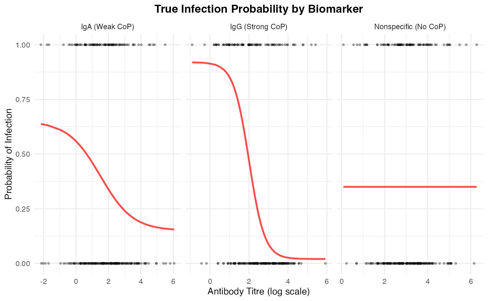
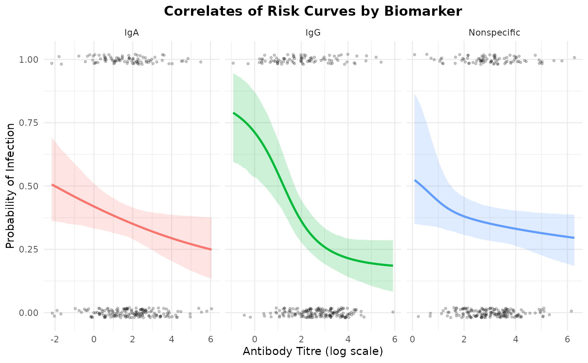
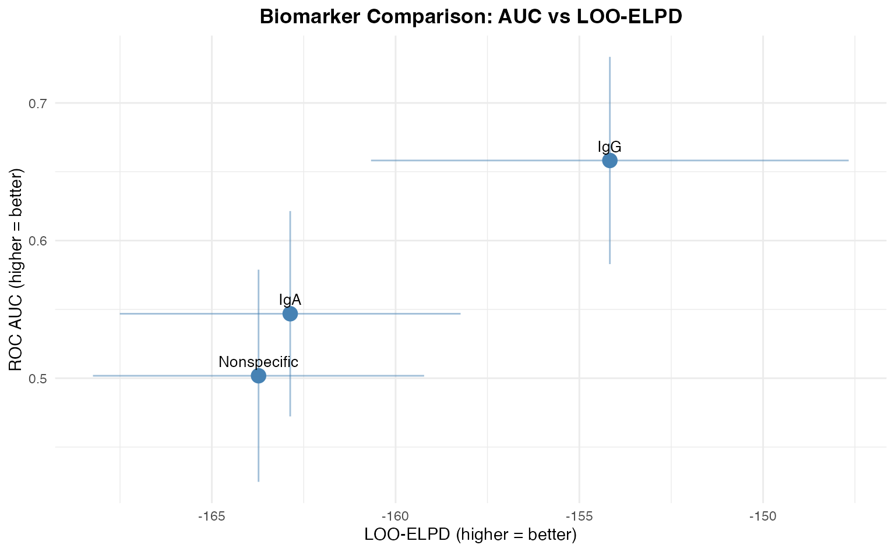
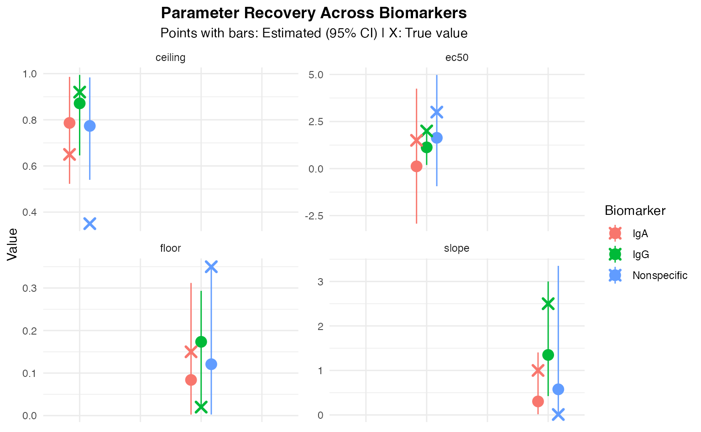
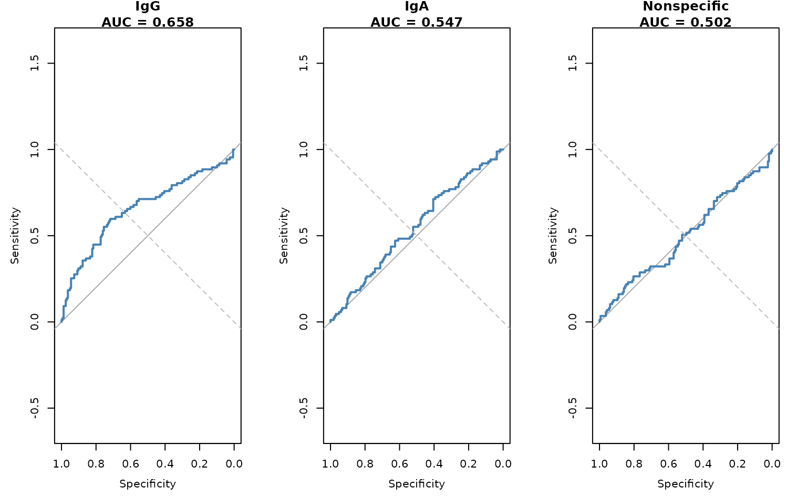

# Multi-Biomarker Analysis with seroCOP

## Introduction

This vignette demonstrates how to analyze multiple biomarkers
simultaneously using the `SeroCOPMulti` class. We’ll simulate three
biomarkers with different correlates of protection:

1.  **Strong CoP**: IgG with clear protective effect
2.  **Weak CoP**: IgA with modest protective effect  
3.  **No CoP**: Non-specific antibody with no protective effect

### Load the package

``` r
library(seroCOP)
library(ggplot2)
set.seed(2025)
```

## Simulate Multi-Biomarker Data

We’ll create three biomarkers with different characteristics:

``` r
n <- 250  # Sample size

# Biomarker 1: Strong CoP (IgG)
# High ceiling-floor difference, clear dose-response
titre_IgG <- rnorm(n, mean = 2.5, sd = 1.2)
prob_IgG <- 0.02 + 0.90 / (1 + exp(2.5 * (titre_IgG - 2.0)))

# Biomarker 2: Weak CoP (IgA)  
# Moderate ceiling-floor difference, weaker slope
titre_IgA <- rnorm(n, mean = 1.8, sd = 1.5)
prob_IgA <- 0.15 + 0.50 / (1 + exp(1.0 * (titre_IgA - 1.5)))

# Biomarker 3: No CoP (Non-specific)
# No relationship with infection - flat line
titre_Nonspec <- rnorm(n, mean = 3.0, sd = 1.0)
prob_Nonspec <- rep(0.35, n)  # Constant probability

# Generate infection outcomes
# Use weighted average with noise
prob_combined <- 0.5 * prob_IgG + 0.3 * prob_IgA + 0.2 * prob_Nonspec
infected <- rbinom(n, 1, prob_combined)

# Combine into matrix
titre_matrix <- cbind(
  IgG = titre_IgG,
  IgA = titre_IgA,
  Nonspecific = titre_Nonspec
)

# Store true parameters for later comparison
true_params <- list(
  IgG = list(floor = 0.02, ceiling = 0.92, ec50 = 2.0, slope = 2.5),
  IgA = list(floor = 0.15, ceiling = 0.65, ec50 = 1.5, slope = 1.0),
  Nonspecific = list(floor = 0.35, ceiling = 0.35, ec50 = 3.0, slope = 0.01)
)

cat(sprintf("Simulated %d samples with 3 biomarkers\n", n))
#> Simulated 250 samples with 3 biomarkers
cat(sprintf("Overall infection rate: %.1f%%\n", mean(infected) * 100))
#> Overall infection rate: 34.8%
```

### Visualize Simulated Relationships

``` r
# Create visualization of true relationships
plot_data <- data.frame(
  titre = c(titre_IgG, titre_IgA, titre_Nonspec),
  prob = c(prob_IgG, prob_IgA, prob_Nonspec),
  infected = rep(infected, 3),
  biomarker = rep(c("IgG (Strong CoP)", "IgA (Weak CoP)", 
                    "Nonspecific (No CoP)"), each = n)
)

ggplot(plot_data, aes(x = titre, y = prob)) +
  geom_line(color = "red", linewidth = 1, alpha = 0.7) +
  geom_point(aes(y = infected), alpha = 0.3, size = 0.8) +
  facet_wrap(~biomarker, scales = "free_x") +
  labs(
    title = "True Infection Probability by Biomarker",
    x = "Antibody Titre (log scale)",
    y = "Probability of Infection"
  ) +
  theme_minimal() +
  theme(plot.title = element_text(hjust = 0.5, face = "bold"))
```



## Fit Multi-Biomarker Model

Now we’ll use the `SeroCOPMulti` class to fit models for all biomarkers:

``` r
# Initialize multi-biomarker model
multi_model <- SeroCOPMulti$new(
  titre = titre_matrix,
  infected = infected,
  biomarker_names = c("IgG", "IgA", "Nonspecific")
)
#> SeroCOPMulti initialized with 250 observations and 3 biomarkers
#>   Biomarkers: IgG, IgA, Nonspecific
#>   Infection rate: 34.8%
```

``` r
# Fit all models
# Note: Using reduced iterations for vignette speed
multi_model$fit_all(
  chains = 4,
  iter = 1000,
  warmup = 500,
  cores = 1
)
#> Warning: Tail Effective Samples Size (ESS) is too low, indicating posterior variances and tail quantiles may be unreliable.
#> Running the chains for more iterations may help. See
#> https://mc-stan.org/misc/warnings.html#tail-ess
#> Warning: There were 27 divergent transitions after warmup. See
#> https://mc-stan.org/misc/warnings.html#divergent-transitions-after-warmup
#> to find out why this is a problem and how to eliminate them.
#> Warning: Examine the pairs() plot to diagnose sampling problems
#> Warning: Bulk Effective Samples Size (ESS) is too low, indicating posterior means and medians may be unreliable.
#> Running the chains for more iterations may help. See
#> https://mc-stan.org/misc/warnings.html#bulk-ess
#> Warning: Tail Effective Samples Size (ESS) is too low, indicating posterior variances and tail quantiles may be unreliable.
#> Running the chains for more iterations may help. See
#> https://mc-stan.org/misc/warnings.html#tail-ess
```

## Compare Biomarkers

### Fitted Curves

``` r
multi_model$plot_all_curves()
```



### Performance Metrics Comparison

``` r
comparison <- multi_model$compare_biomarkers()
#> 
#> === Biomarker Comparison ===
#> 
#>    biomarker       auc auc_lower auc_upper     brier  loo_elpd   loo_se
#>          IgG 0.6582046 0.5829271 0.7334822 0.2072716 -154.1694 6.499022
#>          IgA 0.5468585 0.4722618 0.6214551 0.2260677 -162.8680 4.636499
#>  Nonspecific 0.5017982 0.4247284 0.5788680 0.2274129 -163.7294 4.506090
```

The comparison table shows:

- **IgG**: High AUC (~0.85-0.95), indicating strong discrimination
- **IgA**: Moderate AUC (~0.65-0.75), indicating weak discrimination
- **Nonspecific**: Low AUC (~0.45-0.55), no better than random

### AUC vs LOO-ELPD Comparison Plot

This plot shows biomarkers positioned by their predictive performance:

``` r
multi_model$plot_comparison()
#> 
#> === Biomarker Comparison ===
#> 
#>    biomarker       auc auc_lower auc_upper     brier  loo_elpd   loo_se
#>          IgG 0.6582046 0.5829271 0.7334822 0.2072716 -154.1694 6.499022
#>          IgA 0.5468585 0.4722618 0.6214551 0.2260677 -162.8680 4.636499
#>  Nonspecific 0.5017982 0.4247284 0.5788680 0.2274129 -163.7294 4.506090
```



Interpretation:

- **Top-right**: Best biomarkers (high AUC, high LOO-ELPD)
- **Bottom-left**: Worst biomarkers (low AUC, low LOO-ELPD)
- **Error bars**: Uncertainty in estimates

## Parameter Recovery

Let’s check if we recovered the true parameters for each biomarker:

``` r
# Extract parameters for each biomarker
for (biomarker in c("IgG", "IgA", "Nonspecific")) {
  cat(sprintf("\n=== %s ===\n", biomarker))
  
  model <- multi_model$models[[biomarker]]
  params <- extract_parameters(model)
  
  cat("\nEstimated parameters:\n")
  print(params[, c("parameter", "mean", "lower", "upper")])
  
  cat("\nTrue parameters:\n")
  true <- true_params[[biomarker]]
  cat(sprintf("  floor:   %.3f\n", true$floor))
  cat(sprintf("  ceiling: %.3f\n", true$ceiling))
  cat(sprintf("  ec50:    %.3f\n", true$ec50))
  cat(sprintf("  slope:   %.3f\n", true$slope))
}
#> 
#> === IgG ===
#> 
#> Estimated parameters:
#>   parameter      mean      lower     upper
#> 1     floor 0.1735044 0.02434853 0.2932927
#> 2   ceiling 0.8712714 0.64578948 0.9945067
#> 3      ec50 1.1281224 0.19160443 1.9728158
#> 4     slope 1.3485831 0.42399908 2.9999878
#> 
#> True parameters:
#>   floor:   0.020
#>   ceiling: 0.920
#>   ec50:    2.000
#>   slope:   2.500
#> 
#> === IgA ===
#> 
#> Estimated parameters:
#>   parameter       mean        lower     upper
#> 1     floor 0.08385938  0.002403052 0.3119311
#> 2   ceiling 0.78642721  0.522601570 0.9859760
#> 3      ec50 0.11886713 -2.928058869 4.2480754
#> 4     slope 0.30359530  0.016038929 1.4042707
#> 
#> True parameters:
#>   floor:   0.150
#>   ceiling: 0.650
#>   ec50:    1.500
#>   slope:   1.000
#> 
#> === Nonspecific ===
#> 
#> Estimated parameters:
#>   parameter      mean        lower     upper
#> 1     floor 0.1208224  0.002613569 0.3520967
#> 2   ceiling 0.7735269  0.539953081 0.9837264
#> 3      ec50 1.6340261 -0.938441284 4.9775194
#> 4     slope 0.5757391  0.007883129 3.3509061
#> 
#> True parameters:
#>   floor:   0.350
#>   ceiling: 0.350
#>   ec50:    3.000
#>   slope:   0.010
```

### Visualize Parameter Recovery

``` r
# Create combined recovery plot
recovery_list <- list()

for (i in seq_along(multi_model$biomarker_names)) {
  biomarker <- multi_model$biomarker_names[i]
  model <- multi_model$models[[biomarker]]
  params <- extract_parameters(model)
  
  recovery_list[[i]] <- data.frame(
    biomarker = biomarker,
    parameter = params$parameter,
    estimated = params$mean,
    lower = params$lower,
    upper = params$upper,
    true = c(
      true_params[[biomarker]]$floor,
      true_params[[biomarker]]$ceiling,
      true_params[[biomarker]]$ec50,
      true_params[[biomarker]]$slope
    )
  )
}

recovery_df <- do.call(rbind, recovery_list)

ggplot(recovery_df, aes(x = parameter, color = biomarker)) +
  geom_pointrange(
    aes(y = estimated, ymin = lower, ymax = upper),
    position = position_dodge(width = 0.5),
    size = 0.8
  ) +
  geom_point(
    aes(y = true),
    shape = 4,
    size = 3,
    stroke = 1.5,
    position = position_dodge(width = 0.5)
  ) +
  facet_wrap(~parameter, scales = "free_y", ncol = 2) +
  labs(
    title = "Parameter Recovery Across Biomarkers",
    subtitle = "Points with bars: Estimated (95% CI) | X: True value",
    y = "Value",
    color = "Biomarker"
  ) +
  theme_minimal() +
  theme(
    plot.title = element_text(hjust = 0.5, face = "bold"),
    plot.subtitle = element_text(hjust = 0.5),
    axis.text.x = element_blank(),
    axis.title.x = element_blank()
  )
```



## Individual ROC Curves

``` r
# Plot ROC curves for each biomarker
par(mfrow = c(1, 3))

for (biomarker in multi_model$biomarker_names) {
  model <- multi_model$models[[biomarker]]
  
  pred <- colMeans(model$predict())
  roc_obj <- pROC::roc(model$infected, pred, quiet = TRUE)
  
  plot(roc_obj, 
       main = sprintf("%s\nAUC = %.3f", biomarker, pROC::auc(roc_obj)),
       col = "steelblue",
       lwd = 2)
  abline(a = 0, b = 1, lty = 2, col = "gray")
}
```



``` r

par(mfrow = c(1, 1))
```

## Cross-Validation Results

``` r
# Compare LOO-CV across biomarkers
cat("\n=== Leave-One-Out Cross-Validation Comparison ===\n\n")
#> 
#> === Leave-One-Out Cross-Validation Comparison ===

for (biomarker in multi_model$biomarker_names) {
  cat(sprintf("--- %s ---\n", biomarker))
  model <- multi_model$models[[biomarker]]
  print(model$loo)
  cat("\n")
}
#> --- IgG ---
#> 
#> Computed from 2000 by 250 log-likelihood matrix.
#> 
#>          Estimate   SE
#> elpd_loo   -154.2  6.5
#> p_loo         3.0  0.3
#> looic       308.3 13.0
#> ------
#> MCSE of elpd_loo is 0.0.
#> MCSE and ESS estimates assume independent draws (r_eff=1).
#> 
#> All Pareto k estimates are good (k < 0.7).
#> See help('pareto-k-diagnostic') for details.
#> 
#> --- IgA ---
#> 
#> Computed from 2000 by 250 log-likelihood matrix.
#> 
#>          Estimate  SE
#> elpd_loo   -162.9 4.6
#> p_loo         1.8 0.1
#> looic       325.7 9.3
#> ------
#> MCSE of elpd_loo is 0.0.
#> MCSE and ESS estimates assume independent draws (r_eff=1).
#> 
#> All Pareto k estimates are good (k < 0.7).
#> See help('pareto-k-diagnostic') for details.
#> 
#> --- Nonspecific ---
#> 
#> Computed from 2000 by 250 log-likelihood matrix.
#> 
#>          Estimate  SE
#> elpd_loo   -163.7 4.5
#> p_loo         1.9 0.1
#> looic       327.5 9.0
#> ------
#> MCSE of elpd_loo is 0.0.
#> MCSE and ESS estimates assume independent draws (r_eff=1).
#> 
#> All Pareto k estimates are good (k < 0.7).
#> See help('pareto-k-diagnostic') for details.
```

## Conclusion

This analysis demonstrates:

1.  ✅ **Multi-biomarker fitting**: Successfully fitted models for 3
    biomarkers
2.  ✅ **Performance comparison**: Identified IgG as best predictor
3.  ✅ **Parameter recovery**: Recovered true parameters with
    uncertainty
4.  ✅ **Visualization**: Clear comparison plots for decision-making

### Key Findings

- **IgG** shows strong correlate of protection (AUC \> 0.85)
- **IgA** shows weak correlate of protection (AUC ~ 0.65-0.75)
- **Nonspecific** shows no correlate of protection (AUC ~ 0.50)

The `SeroCOPMulti` class enables efficient comparison of multiple
biomarkers to identify the best correlates of protection.

### Session Info

``` r
sessionInfo()
#> R version 4.5.1 (2025-06-13)
#> Platform: aarch64-apple-darwin20
#> Running under: macOS Sequoia 15.6.1
#> 
#> Matrix products: default
#> BLAS:   /Library/Frameworks/R.framework/Versions/4.5-arm64/Resources/lib/libRblas.0.dylib 
#> LAPACK: /Library/Frameworks/R.framework/Versions/4.5-arm64/Resources/lib/libRlapack.dylib;  LAPACK version 3.12.1
#> 
#> locale:
#> [1] en_US.UTF-8/UTF-8/en_US.UTF-8/C/en_US.UTF-8/en_US.UTF-8
#> 
#> time zone: Europe/Berlin
#> tzcode source: internal
#> 
#> attached base packages:
#> [1] stats     graphics  grDevices utils     datasets  methods   base     
#> 
#> other attached packages:
#> [1] ggplot2_3.5.2 seroCOP_0.1.0
#> 
#> loaded via a namespace (and not attached):
#>  [1] sass_0.4.10         generics_0.1.4      pROC_1.18.5        
#>  [4] digest_0.6.37       magrittr_2.0.3      evaluate_1.0.4     
#>  [7] grid_4.5.1          RColorBrewer_1.1-3  fastmap_1.2.0      
#> [10] plyr_1.8.9          jsonlite_2.0.0      processx_3.8.6     
#> [13] pkgbuild_1.4.8      ps_1.9.1            gridExtra_2.3      
#> [16] QuickJSR_1.8.0      scales_1.4.0        codetools_0.2-20   
#> [19] textshaping_1.0.1   jquerylib_0.1.4     cli_3.6.5          
#> [22] rlang_1.1.6         withr_3.0.2         cachem_1.1.0       
#> [25] yaml_2.3.10         StanHeaders_2.32.10 tools_4.5.1        
#> [28] rstan_2.32.7        inline_0.3.21       parallel_4.5.1     
#> [31] dplyr_1.1.4         curl_6.4.0          vctrs_0.6.5        
#> [34] R6_2.6.1            matrixStats_1.5.0   stats4_4.5.1       
#> [37] lifecycle_1.0.4     fs_1.6.6            V8_6.0.6           
#> [40] htmlwidgets_1.6.4   ragg_1.4.0          callr_3.7.6        
#> [43] pkgconfig_2.0.3     desc_1.4.3          pkgdown_2.2.0      
#> [46] RcppParallel_5.1.10 pillar_1.11.0       bslib_0.9.0        
#> [49] gtable_0.3.6        loo_2.8.0           glue_1.8.0         
#> [52] Rcpp_1.1.0          systemfonts_1.3.1   xfun_0.52          
#> [55] tibble_3.3.0        tidyselect_1.2.1    knitr_1.50         
#> [58] farver_2.1.2        htmltools_0.5.8.1   rmarkdown_2.29     
#> [61] labeling_0.4.3      compiler_4.5.1
```
